# Autoware Installation and Configuration Guide

## I. Flashing the System

1. Prepare a virtual machine with Ubuntu 20.04. Reference: [Flashing Guide](https://gitee.com/plink718/plink-jetpack/tree/master/flashPatch/36.3/AGX-Orin/Y-C8)
   - Enter recovery mode by connecting the micro USB interface first, then press the REC key.
   - Set virtual machine space to 120G.
   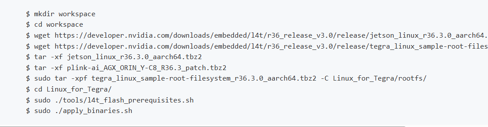
   - If issues persist with 36.3, use 36.2: [36.2 Flashing Guide](https://gitee.com/plink718/plink-jetpack/tree/master/flashPatch/36.2/AGX-Orin/Y-C8)
   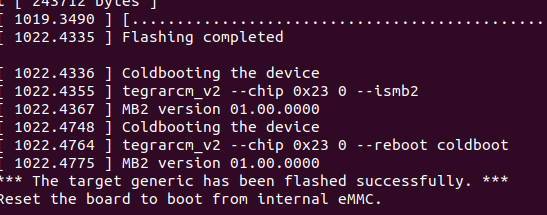

2. Mount SSD to home directory. Reference: [SSD Mounting Guide](https://blog.csdn.net/qq_33232152/article/details/140341819)
   - If differences occur after `sudo fdisk /dev/nvme0n1`:
     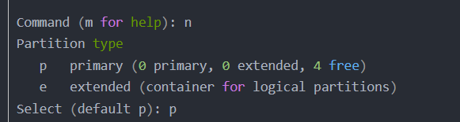
   - Delete partition with 'd' and continue:
     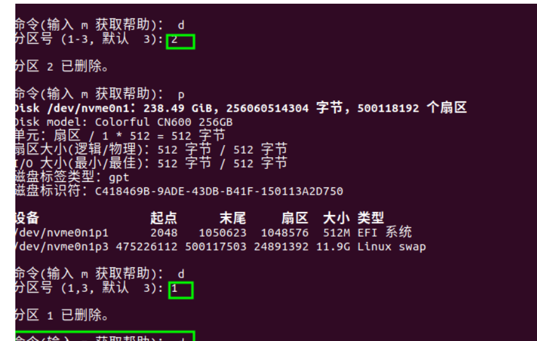

3. Use FishROS to change system sources:
   ```bash
   wget http://fishros.com/install -O fishros && . fishros
   ```
   Choose the source change command, but do not clear third-party sources.

4. Install Firefox browser and Todesk remote software.

5. Install JetPack:
   - Use CUDA, cuDNN, and TensorRT that come with the flashed system.
   - If JetPack cannot be installed in one click, refer to: [JetPack Installation Guide](https://blog.csdn.net/weixin_43702653/article/details/129249585)
   - For installation issues, see: [Troubleshooting Guide](https://blog.csdn.net/Black__Jacket/article/details/127736938)
   - Potential dependency issues: [Dependency Issues](https://blog.csdn.net/m0_74116869/article/details/136608871)
     
   - Check CUDA components with jtop:
     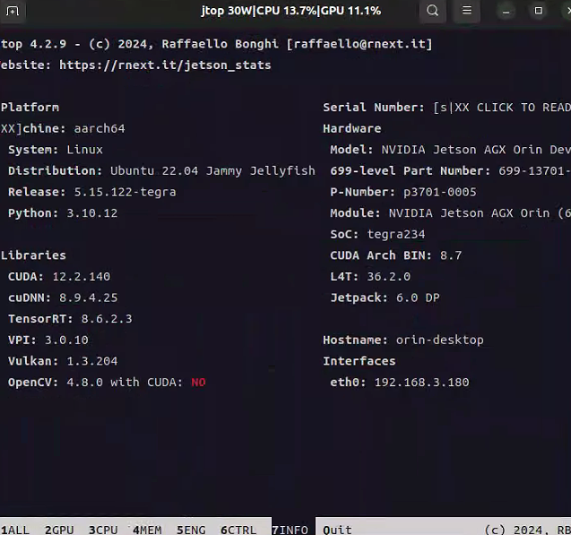
   - Configure cuDNN according to version:
     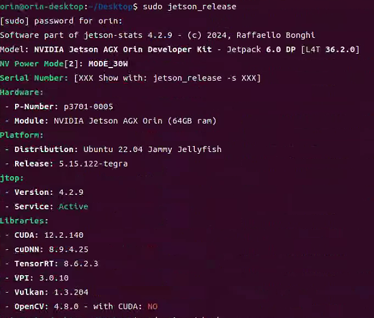
   
   ```bash
   sudo ln -sf libcudnn.so.8.9.4 libcudnn.so.8
   sudo ln -sf libcudnn_ops_train.so.8.9.4 libcudnn_ops_train.so.8
   sudo ln -sf libcudnn_ops_infer.so.8.9.4 libcudnn_ops_infer.so.8
   sudo ln -sf libcudnn_adv_train.so.8.9.4 libcudnn_adv_train.so.8
   sudo ln -sf libcudnn_adv_infer.so.8.9.4 libcudnn_adv_infer.so.8
   sudo ln -sf libcudnn_cnn_train.so.8.9.4 libcudnn_cnn_train.so.8
   sudo ln -sf libcudnn_cnn_infer.so.8.9.4 libcudnn_cnn_infer.so.8
   ```

6. Install ROS2 Humble and VSCode using FishROS:
   ```bash
   wget http://fishros.com/install -O fishros && . fishros
   ```

## II. Installing Autoware.universe on Ubuntu 22.04 with ROS Humble

0. Set up VPN for git:
   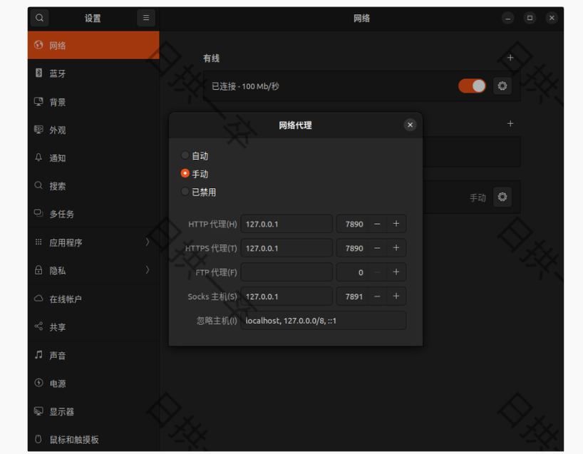
   ```bash
   git config --global http.proxy 127.0.0.1:7890
   git config --global https.proxy 127.0.0.1:7890
   ```

1. Install dependencies:
   ```bash
   sudo apt-get -y update
   sudo apt-get -y install git
   mkdir autoware_universe
   cd autoware_universe/
   git clone https://github.com/autowarefoundation/autoware.git
   sudo apt update && sudo apt install -y \
     build-essential \
     cmake \
     git \
     wget \
     ros-dev-tools \
     python3-pip \
     python3-rosdep \
     python3-setuptools \
     python3-vcstool \
     python3-testresources \
     python3-pytest \
     python3-pytest-cov \
     python3-pytest-repeat \
     python3-pytest-rerunfailures \
     python3-colcon-common-extensions \
     python3-flake8 \
     python3-flake8-docstrings \
     python3-flake8-blind-except \
     python3-flake8-builtins \
     python3-flake8-class-newline \
     python3-flake8-comprehensions \
     python3-flake8-deprecated \
     python3-flake8-import-order \
     python3-flake8-quotes
   sudo rosdep init
   rosdep update
   cd autoware
   source amd64.env
   sudo apt update
   rmw_implementation_dashed=$(eval sed -e "s/_/-/g" <<< "${rmw_implementation}")
   sudo apt install ros-${rosdistro}-${rmw_implementation_dashed}
   echo '' >> ~/.bashrc && echo "export RMW_IMPLEMENTATION=${rmw_implementation}" >> ~/.bashrc
   sudo apt install apt-transport-https
   sudo sh -c 'echo "deb [trusted=yes] https://s3.amazonaws.com/autonomoustuff-repo/ $(lsb_release -sc) main" > /etc/apt/sources.list.d/autonomoustuff-public.list'
   sudo apt update
   sudo apt install ros-${rosdistro}-pacmod3
   pip3 install gdown -i https://pypi.tuna.tsinghua.edu.cn/simple some-package
   sudo apt install geographiclib-tools
   sudo geographiclib-get-geoids egm2008-1
   clang_format_version=16.0.0
   pip3 install pre-commit clang-format==${clang_format_version} -i https://pypi.tuna.tsinghua.edu.cn/simple some-package
   sudo apt install golang
   ```

2. Autoware source installation:
   ```bash
   cd autoware
   mkdir src
   vcs import src < autoware.repos
   ```
   - If vcs import fails, add proxy to URLs in autoware.repos:
     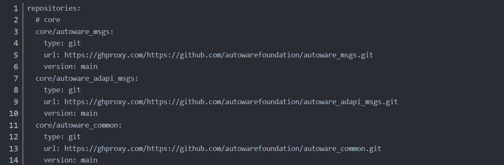

3. Build Autoware:
   ```bash
   colcon build --symlink-install --cmake-args -DCMAKE_BUILD_TYPE=Release
   ```
   - Troubleshoot OpenCV issues if encountered:
     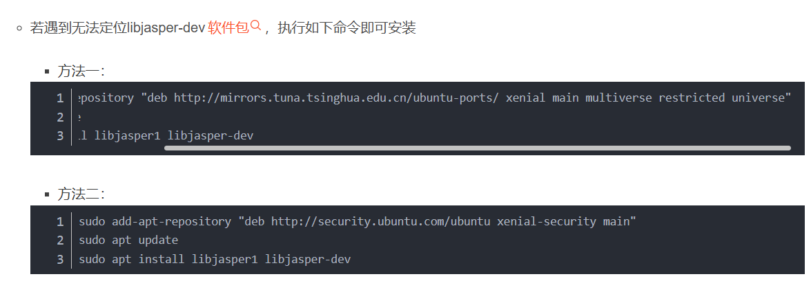
     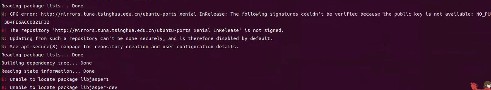
     
     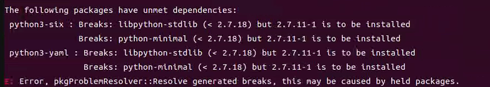
   - Manual map download may be required:
     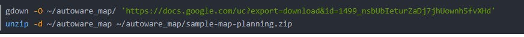
   - Successful build:
     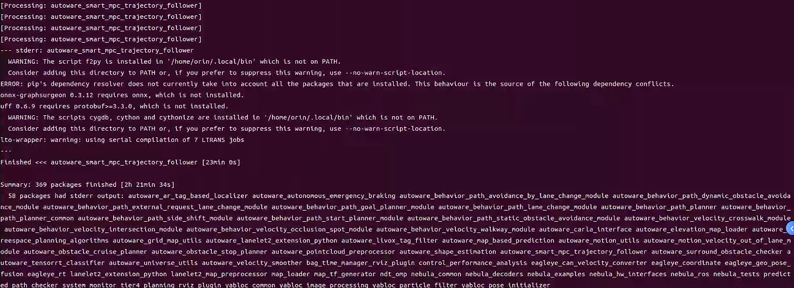

4. Run official example:
   ```bash
   cd autoware
   source install/setup.bash
   ros2 launch autoware_launch planning_simulator.launch.xml map_path:=$HOME/autoware_map/sample-map-planning vehicle_model:=sample_vehicle sensor_model:=sample_sensor_kit
   ```
   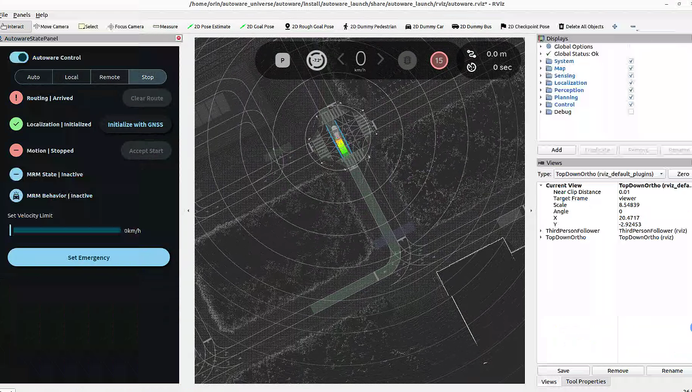

## III. Setting Up CAN on ORIN and Configuring Auto-start

1. Install CAN dependencies:
   ```bash
   sudo apt-get install busybox can-utils
   ```

2. Test CAN connectivity:
   ```bash
   sudo busybox devmem 0x0c303018 w 0xc458
   sudo busybox devmem 0x0c303010 w 0xc400
   sudo busybox devmem 0x0c303008 w 0xc458
   sudo busybox devmem 0x0c303000 w 0xc400
   sudo modprobe can
   sudo modprobe can_raw
   sudo modprobe can_dev
   sudo modprobe mttcan
   sudo ip link set can0 type can bitrate 500000
   sudo ip link set can1 type can bitrate 500000
   sudo ip link set up can0
   sudo ip link set up can1
   candump can0
   candump can1
   ```

3. Set up CAN auto-start:
   ```bash
   sudo mv setup_can.sh /usr/local/bin/setup_can.sh
   sudo chmod +x /usr/local/bin/setup_can.sh
   sudo gedit /etc/systemd/system/setup-can.service
   ```
   Add the following content to the service file:
   ```
   [Unit]
   Description=Setup CAN interfaces
   After=network.target

   [Service]
   Type=oneshot
   ExecStart=/usr/local/bin/setup_can.sh
   RemainAfterExit=yes

   [Install]
   WantedBy=multi-user.target
   ```
   ```bash
   sudo systemctl daemon-reload
   sudo systemctl enable setup-can.service
   sudo systemctl start setup-can.service
   ```

## IV. Sensor ROS Driver Compilation and Testing

1. Copy sensor_driver files to /home/orin/autoware_universe/autoware/src
2. Refer to specific driver sources for camera, chassis, and LiDAR
3. Compile in /home/orin/autoware_universe/autoware:
   ```bash
   colcon build --packages-skip fixposition_driver_ros1 fixposition_odometry_converter_ros1
   ```

## V. Deploying Official UTM to MGRS Map Conversion Program

Refer to: [UTM to MGRS Conversion Guide](https://autowarefoundation.github.io/autoware-documentation/main/how-to-guides/integrating-autoware/creating-maps/converting-utm-to-mgrs-map/)


———————————————————————————————————————————————————————————————————————————————————————————————————————————


# Autoware 安装和配置指南

## 一、刷机

1. 准备一台搭载 Ubuntu 20.04 的虚拟机。参考：[刷机指南](https://gitee.com/plink718/plink-jetpack/tree/master/flashPatch/36.3/AGX-Orin/Y-C8)
   - 进入恢复模式时，先连接工控机的 micro USB 接口，再按住 REC 键。
   - 虚拟机空间设置为 120G。
   
   - 如果 36.3 版本存在问题，使用 36.2 版本：[36.2 刷机指南](https://gitee.com/plink718/plink-jetpack/tree/master/flashPatch/36.2/AGX-Orin/Y-C8)
   

2. 将 SSD 挂载到 home 目录下。参考：[SSD 挂载指南](https://blog.csdn.net/qq_33232152/article/details/140341819)
   - 如果在执行 `sudo fdisk /dev/nvme0n1` 命令后出现差异：
     
   - 先按 'd' 删除分区后继续：
     

3. 使用鱼香 ROS 更改系统源：
   ```bash
   wget http://fishros.com/install -O fishros && . fishros
   ```
   选择换源命令，不要清除第三方源。

4. 为新系统安装 Firefox 浏览器，然后安装 Todesk 远程软件。

5. 安装 JetPack：
   - 使用刷机自带的 CUDA、cuDNN 和 TensorRT。
   - 如果 JetPack 无法一键安装，参考：[JetPack 安装指南](https://blog.csdn.net/weixin_43702653/article/details/129249585)
   - 安装问题参考：[故障排除指南](https://blog.csdn.net/Black__Jacket/article/details/127736938)
   - 可能出现的依赖问题：[依赖问题](https://blog.csdn.net/m0_74116869/article/details/136608871)
     
   - 用 jtop 检查 CUDA 组件：
     
   - 根据版本配置 cuDNN：
     
   
   ```bash
   sudo ln -sf libcudnn.so.8.9.4 libcudnn.so.8
   sudo ln -sf libcudnn_ops_train.so.8.9.4 libcudnn_ops_train.so.8
   sudo ln -sf libcudnn_ops_infer.so.8.9.4 libcudnn_ops_infer.so.8
   sudo ln -sf libcudnn_adv_train.so.8.9.4 libcudnn_adv_train.so.8
   sudo ln -sf libcudnn_adv_infer.so.8.9.4 libcudnn_adv_infer.so.8
   sudo ln -sf libcudnn_cnn_train.so.8.9.4 libcudnn_cnn_train.so.8
   sudo ln -sf libcudnn_cnn_infer.so.8.9.4 libcudnn_cnn_infer.so.8
   ```

6. 使用鱼香 ROS 安装 ROS2 Humble 和 VSCode：
   ```bash
   wget http://fishros.com/install -O fishros && . fishros
   ```

## 二、在 Ubuntu 22.04 上基于 ROS Humble 安装 Autoware.universe

0. 为 git 设置 VPN：
   
   ```bash
   git config --global http.proxy 127.0.0.1:7890
   git config --global https.proxy 127.0.0.1:7890
   ```

1. 安装依赖：
   ```bash
   sudo apt-get -y update
   sudo apt-get -y install git
   mkdir autoware_universe
   cd autoware_universe/
   git clone https://github.com/autowarefoundation/autoware.git
   sudo apt update && sudo apt install -y \
     build-essential \
     cmake \
     git \
     wget \
     ros-dev-tools \
     python3-pip \
     python3-rosdep \
     python3-setuptools \
     python3-vcstool \
     python3-testresources \
     python3-pytest \
     python3-pytest-cov \
     python3-pytest-repeat \
     python3-pytest-rerunfailures \
     python3-colcon-common-extensions \
     python3-flake8 \
     python3-flake8-docstrings \
     python3-flake8-blind-except \
     python3-flake8-builtins \
     python3-flake8-class-newline \
     python3-flake8-comprehensions \
     python3-flake8-deprecated \
     python3-flake8-import-order \
     python3-flake8-quotes
   sudo rosdep init
   rosdep update
   cd autoware
   source amd64.env
   sudo apt update
   rmw_implementation_dashed=$(eval sed -e "s/_/-/g" <<< "${rmw_implementation}")
   sudo apt install ros-${rosdistro}-${rmw_implementation_dashed}
   echo '' >> ~/.bashrc && echo "export RMW_IMPLEMENTATION=${rmw_implementation}" >> ~/.bashrc
   sudo apt install apt-transport-https
   sudo sh -c 'echo "deb [trusted=yes] https://s3.amazonaws.com/autonomoustuff-repo/ $(lsb_release -sc) main" > /etc/apt/sources.list.d/autonomoustuff-public.list'
   sudo apt update
   sudo apt install ros-${rosdistro}-pacmod3
   pip3 install gdown -i https://pypi.tuna.tsinghua.edu.cn/simple some-package
   sudo apt install geographiclib-tools
   sudo geographiclib-get-geoids egm2008-1
   clang_format_version=16.0.0
   pip3 install pre-commit clang-format==${clang_format_version} -i https://pypi.tuna.tsinghua.edu.cn/simple some-package
   sudo apt install golang
   ```

2. Autoware 源码安装：
   ```bash
   cd autoware
   mkdir src
   vcs import src < autoware.repos
   ```
   - 如果 vcs import 失败，在 autoware.repos 中的 URL 前添加代理：
     

3. 编译 Autoware：
   ```bash
   colcon build --symlink-install --cmake-args -DCMAKE_BUILD_TYPE=Release
   ```
   - 遇到 OpenCV 问题时进行故障排除：
     
     
     
     
   - 可能需要手动下载地图：
     
   - 成功编译：
     

4. 运行官方示例：
   ```bash
   cd autoware
   source install/setup.bash
   ros2 launch autoware_launch planning_simulator.launch.xml map_path:=$HOME/autoware_map/sample-map-planning vehicle_model:=sample_vehicle sensor_model:=sample_sensor_kit
   ```
   

## 三、设置 ORIN 的 CAN 并配置自启动

1. 安装 CAN 依赖：
   ```bash
   sudo apt-get install busybox can-utils
   ```

2. 测试 CAN 连通性：
   ```bash
   sudo busybox devmem 0x0c303018 w 0xc458
   sudo busybox devmem 0x0c303010 w 0xc400
   sudo busybox devmem 0x0c303008 w 0xc458
   sudo busybox devmem 0x0c303000 w 0xc400
   sudo modprobe can
   sudo modprobe can_raw
   sudo modprobe can_dev
   sudo modprobe mttcan
   sudo ip link set can0 type can bitrate 500000
   sudo ip link set can1 type can bitrate 500000
   sudo ip link set up can0
   sudo ip link set up can1
   candump can0
   candump can1
   ```

3. 设置 CAN 自启动：
   ```bash
   sudo mv setup_can.sh /usr/local/bin/setup_can.sh
   sudo chmod +x /usr/local/bin/setup_can.sh
   sudo gedit /etc/systemd/system/setup-can.service
   ```
   在服务文件中添加以下内容：
   ```
   [Unit]
   Description=Setup CAN interfaces
   After=network.target

   [Service]
   Type=oneshot
   ExecStart=/usr/local/bin/setup_can.sh
   RemainAfterExit=yes

   [Install]
   WantedBy=multi-user.target
   ```
   ```bash
   sudo systemctl daemon-reload
   sudo systemctl enable setup-can.service
   sudo systemctl start setup-can.service
   ```

## 四、传感器 ROS 驱动编译与测试

1. 将 sensor_driver 文件复制到 /home/orin/autoware_universe/autoware/src 中
2. 参考特定驱动源进行相机、底盘和激光雷达的设置
3. 在 /home/orin/autoware_universe/autoware 中编译：
   ```bash
   colcon build --packages-skip fixposition_driver_ros1 fixposition_odometry_converter_ros1
   ```

## 五、部署官方 UTM 到 MGRS 地图转换程序

参考：[UTM 到 MGRS 转换指南](https://autowarefoundation.github.io/autoware-documentation/main/how-to-guides/integrating-autoware/creating-maps/converting-utm-to-mgrs-map/)


