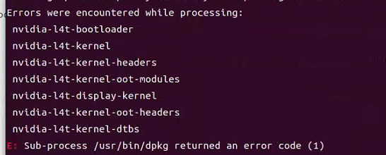
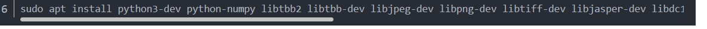
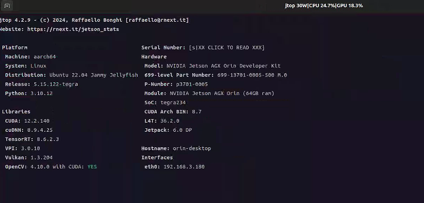

# Autoware Installation and Configuration Guide

## I. Flashing the System

1. Prepare a virtual machine with Ubuntu 20.04. Reference: [Flashing Guide](https://gitee.com/plink718/plink-jetpack/tree/master/flashPatch/36.3/AGX-Orin/Y-C8)
   - Enter recovery mode by connecting the micro USB interface first, then press the REC key.
   - Set virtual machine space to 120G. 
   
   - If issues persist with 36.3, use 36.2: [36.2 Flashing Guide](https://gitee.com/plink718/plink-jetpack/tree/master/flashPatch/36.2/AGX-Orin/Y-C8)
   

2. Mount SSD to home directory. Reference: [SSD Mounting Guide](https://blog.csdn.net/qq_33232152/article/details/140341819)
   - If differences occur after `sudo fdisk /dev/nvme0n1`:
     
   - Delete partition with 'd' and continue:
     

3. Use FishROS to change system sources:
   ```bash
   wget http://fishros.com/install -O fishros && . fishros
   ```
   Choose the source change command, but do not clear third-party sources.

4. Install Firefox browser and Todesk remote software.

5. Install JetPack:
   - Use CUDA, cuDNN, and TensorRT that come with the flashed system.
   - If JetPack cannot be installed in one click, refer to: [JetPack Installation Guide](https://blog.csdn.net/weixin_43702653/article/details/129249585)
   - For installation issues, see: [Troubleshooting Guide](https://blog.csdn.net/Black__Jacket/article/details/127736938)
     - Issue: Dependency problems
     
       
       
       Solution: Install missing dependencies
   - Check CUDA components with jtop:
     
     
   - Configure cuDNN according to version:
     
     
   
   ```bash
   sudo ln -sf libcudnn.so.8.9.4 libcudnn.so.8
   sudo ln -sf libcudnn_ops_train.so.8.9.4 libcudnn_ops_train.so.8
   sudo ln -sf libcudnn_ops_infer.so.8.9.4 libcudnn_ops_infer.so.8
   sudo ln -sf libcudnn_adv_train.so.8.9.4 libcudnn_adv_train.so.8
   sudo ln -sf libcudnn_adv_infer.so.8.9.4 libcudnn_adv_infer.so.8
   sudo ln -sf libcudnn_cnn_train.so.8.9.4 libcudnn_cnn_train.so.8
   sudo ln -sf libcudnn_cnn_infer.so.8.9.4 libcudnn_cnn_infer.so.8
   ```

6. Install ROS2 Humble and VSCode using FishROS:
   ```bash
   wget http://fishros.com/install -O fishros && . fishros
   ```

## II. Installing Autoware.universe on Ubuntu 22.04 with ROS Humble

1. Set up VPN for git:

   
   ```bash
   git config --global http.proxy 127.0.0.1:7890
   git config --global https.proxy 127.0.0.1:7890
   ```

2. Install dependencies:
   ```bash
   sudo apt-get -y update
   sudo apt-get -y install git
   mkdir autoware_universe
   cd autoware_universe/
   git clone https://github.com/autowarefoundation/autoware.git
   sudo apt update && sudo apt install -y \
     build-essential \
     cmake \
     git \
     wget \
     ros-dev-tools \
     python3-pip \
     python3-rosdep \
     python3-setuptools \
     python3-vcstool \
     python3-testresources \
     python3-pytest \
     python3-pytest-cov \
     python3-pytest-repeat \
     python3-pytest-rerunfailures \
     python3-colcon-common-extensions \
     python3-flake8 \
     python3-flake8-docstrings \
     python3-flake8-blind-except \
     python3-flake8-builtins \
     python3-flake8-class-newline \
     python3-flake8-comprehensions \
     python3-flake8-deprecated \
     python3-flake8-import-order \
     python3-flake8-quotes
   sudo rosdep init
   rosdep update
   # Resolving rosdep update error
   sudo mkdir -p /etc/ros/rosdep/sources.list.d/
   sudo curl -o /etc/ros/rosdep/sources.list.d/20-default.list https://mirrors.tuna.tsinghua.edu.cn/github-raw/ros/rosdistro/master/rosdep/sources.list.d/20-default.list
   export ROSDISTRO_INDEX_URL=https://mirrors.tuna.tsinghua.edu.cn/rosdistro/index-v4.yaml
   rosdep update
   cd autoware
   source amd64.env
   sudo apt update
   rmw_implementation_dashed=$(eval sed -e "s/_/-/g" <<< "${rmw_implementation}")
   sudo apt install ros-${rosdistro}-${rmw_implementation_dashed}
   echo '' >> ~/.bashrc && echo "export RMW_IMPLEMENTATION=${rmw_implementation}" >> ~/.bashrc
   sudo apt install apt-transport-https
   sudo sh -c 'echo "deb [trusted=yes] https://s3.amazonaws.com/autonomoustuff-repo/ $(lsb_release -sc) main" > /etc/apt/sources.list.d/autonomoustuff-public.list'
   sudo apt update
   sudo apt install ros-${rosdistro}-pacmod3
   pip3 install gdown -i https://pypi.tuna.tsinghua.edu.cn/simple some-package
   sudo apt install geographiclib-tools
   sudo geographiclib-get-geoids egm2008-1
   clang_format_version=16.0.0
   pip3 install pre-commit clang-format==${clang_format_version} -i https://pypi.tuna.tsinghua.edu.cn/simple some-package
   sudo apt install golang
   ```

3. Autoware source installation:
   ```bash
   cd autoware
   mkdir src
   vcs import src < autoware.repos
   ```
   - If vcs import fails, add proxy to URLs in autoware.repos:

     

4. Build Autoware:
   ```bash
   colcon build --symlink-install --cmake-args -DCMAKE_BUILD_TYPE=Release
   ```
   - Troubleshoot OpenCV issues if encountered:
     - OpenCV Issue 1:

        
       Solution: Resolve GPG key error
     - OpenCV Issue 2: 

       
       Solution: Install missing Python packages
     - OpenCV Issue 3:

       
     - OpenCV Issue 4:

       
       Solution: Manually install missing OpenCV and OpenCV_contrib packages

         
   - Manual map download may be required:

     
   - Successful build:

     

5. Run official example:
   ```bash
   cd autoware
   source install/setup.bash
   ros2 launch autoware_launch planning_simulator.launch.xml map_path:=$HOME/autoware_map/sample-map-planning vehicle_model:=sample_vehicle sensor_model:=sample_sensor_kit
   ```
   

## III. Setting Up CAN on ORIN and Configuring Auto-start

1. Install CAN dependencies:
   ```bash
   sudo apt-get install busybox can-utils
   ```

2. Test CAN connectivity:
   ```bash
   sudo busybox devmem 0x0c303018 w 0xc458
   sudo busybox devmem 0x0c303010 w 0xc400
   sudo busybox devmem 0x0c303008 w 0xc458
   sudo busybox devmem 0x0c303000 w 0xc400
   sudo modprobe can
   sudo modprobe can_raw
   sudo modprobe can_dev
   sudo modprobe mttcan
   sudo ip link set can0 type can bitrate 500000
   sudo ip link set can1 type can bitrate 500000
   sudo ip link set up can0
   sudo ip link set up can1
   candump can0
   candump can1
   ```

3. Set up CAN auto-start:
   ```bash
   sudo mv setup_can.sh /usr/local/bin/setup_can.sh
   sudo chmod +x /usr/local/bin/setup_can.sh
   sudo gedit /etc/systemd/system/setup-can.service
   ```
   Add the following content to the service file:
   ```
   [Unit]
   Description=Setup CAN interfaces
   After=network.target

   [Service]
   Type=oneshot
   ExecStart=/usr/local/bin/setup_can.sh
   RemainAfterExit=yes

   [Install]
   WantedBy=multi-user.target
   ```
   ```bash
   sudo systemctl daemon-reload
   sudo systemctl enable setup-can.service
   sudo systemctl start setup-can.service
   ```

## IV. Sensor ROS Driver Compilation and Testing

Repository: https://github.com/silly-h/Fp_autoware_humble

1. Copy the `sensor_driver` file into `/home/orin/autoware_universe/autoware/src`

2. Sensor driver sources:
   - Camera driver: https://docs.luxonis.com/software/ros/depthai-ros/build/
   - Scout chassis driver: https://github.com/agilexrobotics/scout_ros2/tree/humble
     Note: Turn on the remote control to use keyboard control for the vehicle
   - rslidar driver: https://github.com/RoboSense-LiDAR/rslidar_sdk
   - fixposition-VRTK2 driver: https://github.com/fixposition/fixposition_driver

3. Compile in `/home/orin/autoware_universe/autoware`:
   ```
   colcon build --packages-skip fixposition_driver_ros1 fixposition_odometry_converter_ros1
   ```
   Note: Don't use sudo. If permission issues occur, download and compile the source code according to the driver references.

4. Modify topics and frame_ids for lidar, camera, and RTK2:


   | **Sensor** | **Topic** | **Frame ID** |
   |------------|-----------|--------------|
   | LiDAR      | `/points` | `velodyne_link` |
   | IMU        | `/fixposition/corr_imu` | `imu_link` |
   | GPS        | `/fixposition/nav_sat_fix` | `gnss_link` |
   | Camera     | `/color/image` | `camera4/camera_link` |

   Specific modifications:
   - VRTK2/Imu: 
     - In `fixposition_driver_ros2/src/data_to_ros2.cpp`, change lines 33 and 50 to fixed frame_id
     - In `fixposition_driver_ros2/src/fixpostion_driver_node.cpp`, set lines 45 and 46 to corresponding rostopics
     - Comment out lines 60, 61, 148-150, 190, 204 in `fixposition_driver_ros2/src/fixpostion_driver_node`
   - Camera: Modify lines 49 and 52 in `deptahi_examples/ros2_src/rgb_publisher`
   - Lidar: Modify lines 97 and 231 in `rs_to_velodyne/src/rs_to_velodyne.cpp`

## V. Creating Sensor and Vehicle Models

Reference: https://autowarefoundation.github.io/autoware-documentation/main/how-to-guides/

1. Creating Sensor Models:
   - Main reference: https://autowarefoundation.github.io/autoware-documentation/main/how-to-guides/integrating-autoware/creating-vehicle-and-sensor-model/creating-vehicle-model/
   - Main modification location: `/autoware_universe/autoware/src/sensor_kit`
   - Repository: https://github.com/silly-h/Fp_autoware_humble

   1.1. `/autoware_universe/autoware/src/sensor_kit/sample_sensor_kit_launch/sample_sensor_kit_description`: Set external parameters for sensors.
        - IMU internal parameter calibration: https://blog.csdn.net/er_dan_love/article/details/124370788
        - IMU-Lidar external parameter calibration: https://blog.csdn.net/weixin_45205745/article/details/129462125
        Note: These calibration programs may not be applicable to 22.04. Use a virtual machine and convert ROS2bag to ROS1bag for offline calibration.

   1.2. `/autoware_universe/autoware/src/sensor_kit/sample_sensor_kit_launch/sample_sensor_kit_launch`: Launch sensor drivers.
        Note: Use only gnss.launch.xml to launch GNSS and IMU components for VRTK2.

   1.3. Compile this module:
        ```
        colcon build --symlink-install --cmake-args -DCMAKE_BUILD_TYPE=Release --packages-select sample_sensor_kit_description sample_sensor_kit_launch
        ```

2. Creating Vehicle Models:
   - Main reference: https://autowarefoundation.github.io/autoware-documentation/main/how-to-guides/integrating-autoware/creating-vehicle-and-sensor-model/creating-vehicle-model/
   - Main modification location: `/autoware_universe/autoware/src/vehicle`
   - Repository: https://github.com/silly-h/Fp_autoware_humble

   2.1. `/autoware_universe/autoware/src/vehicle/sample_vehicle_launch/sample_vehicle_description/config/mirror.param.yaml`: For point cloud trimming. Set values to 0.0 if the vehicle has no rearview mirrors.

   2.2. `/autoware_universe/autoware/src/vehicle/sample_vehicle_launch/sample_vehicle_description/config/vehicle_info.param.yaml`: Vehicle physical dimension parameters. Refer to: https://agilexrobotics.gitbook.io/scout_mini/6-chan-pin-chi-cun-product-dimensions

   2.3. `/autoware_universe/autoware/src/vehicle/sample_vehicle_launch/sample_vehicle_description/urdf/vehicle.xacro`: For vehicle model display in RViz. Adjust RPY and scaling as needed.

   2.4. `/autoware_universe/autoware/src/vehicle/sample_vehicle_launch/sample_vehicle_launch/launch/vehicle_interface.launch.xml`: Add chassis communication programs:
        ```xml
        <include file="$(find-pkg-share can_communication)/launch/can_communication_launch.py"/>
        <include file="$(find-pkg-share scout_base)/launch/scout_base.launch.py"/>
        ```

   2.5. Compile this module:
        ```
        colcon build --symlink-install --cmake-args -DCMAKE_BUILD_TYPE=Release --packages-select sample_vehicle_launch sample_vehicle_description
        ```

## VI. LiDAR-SLAM Mapping and MGRS Point Cloud Map Creation

Reference: https://autowarefoundation.github.io/autoware-documentation/main/how-to-guides/integrating-autoware/creating-maps/

1. LiDAR-SLAM Mapping:
   - Use modified LIO-SAM algorithm: https://github.com/YJZLuckyBoy/liorf/tree/liorf-ros2
   - Modified repository for VTRK2: https://github.com/silly-h/liorf_ros2
   Note: This algorithm is only applicable to ROS2 Foxy and Galactic versions. Use a virtual machine for offline mapping.

2. UTM to MGRS Map Conversion:
   Reference: https://autowarefoundation.github.io/autoware-documentation/main/how-to-guides/integrating-autoware/creating-maps/converting-utm-to-mgrs-map/
   Additional modifications in src:
   ```cpp
   gnss_stat_utm.zone = 48;  // Set UTM zone to 48
   gnss_stat_utm.northup = true;  // Use northern hemisphere UTM coordinate system
   ```

3. Creating Lanelet2 Map from MGRS Map:
   Reference: https://autowarefoundation.github.io/autoware-documentation/main/how-to-guides/integrating-autoware/creating-maps/creating-vector-map/
   Tool: https://account.tier4.jp/login?flow=ac5b0de7-dea9-41a7-add2-8c9e74df2f28

4. Creating Local Map Files:
   - Create a local map folder in `/home/autoware_map/`
   - Import .osm and .pcd files
   - Set map origin in `map_config.yaml` (refer to `soft/map/first.py` for starting point)
   - Update mgrs_grid in `map_projector_info.yaml`
   - MGRS map code lookup: https://mgrs-mapper.com/app

## VII. Autoware.Universe Source Code Modification for Local Adaptation

Autoware.Universe overall pipeline: [Node Diagram](https://app.diagrams.net/?lightbox=1#Uhttps%3A%2F%2Fautowarefoundation.github.io%2Fautoware-documentation%2Fmain%2Fdesign%2Fautoware-architecture%2Fnode-diagram%2Foverall-node-diagram-autoware-universe.drawio.svg#%7B%22pageId%22%3A%22T6t2FfeAp1iw48vGkmOz%22%7D)

1. Modify gnss_poser package for VRTK2 data type:
   File: `/autoware_universe/autoware/src/universe/autoware.universe/sensing/gnss_poser/gnss_poser_core.cpp`
   Change line 99:
   ```cpp
   const bool is_status_fixed = true;
   ```
   Compile:
   ```
   colcon build --symlink-install --cmake-args -DCMAKE_BUILD_TYPE=Release --packages-select gnss_poser
   ```

2. Modify input point cloud parameters:
   
   Location: `/autoware_universe/autoware/src/launcher/autoware_launch/autoware_launch/config/localization/ndt_scan_matcher/pointcloud_preprocessor`
   Changes:
   - `voxel_grid_filter.param.yaml`: Set all to 0.1
   - `random_downsample_filter.param.yaml`: Set to 3000
   - `crop_box_filter_measurement_range.param.yaml`: Keep unchanged

3. Modify ndt_scan_matcher parameters:
   Location: `/autoware_universe/autoware/src/launcher/autoware_launch/autoware_launch/config/localization/ndt_scan_matcher`
   Changes:
   - required_distance: 5.0 (was 10.0)
   - resolution: 1.5 (was 2.0)
   - initial_to_result_distance_tolerance_m: 2.0 (was 3.0)
   - critical_upper_bound_exe_time_ms: 80.0 (was 100.0)

4. Modify sensor messages to ROS local time:
   4.1. File: `/autoware_universe/autoware/src/universe/autoware.universe/localization/ndt_scan_matcher/src/ndt_scan_matcher_core.cpp`
        Change line 312:
        ```cpp
        const rclcpp::Time sensor_ros_time = this->now();
        ```
        Compile:
        ```
        colcon build --symlink-install --cmake-args -DCMAKE_BUILD_TYPE=Release --packages-select ndt_scan_matcher
        ```

   4.2. File: `/autoware_universe/autoware/src/universe/autoware.universe/localization/gyro_odometer/src/gyro_odometer_core.cpp`
        Changes:
        - Line 88: `latest_vehicle_twist_ros_time_ = this->now();`
        - Line 103: `latest_imu_ros_time_ = this->now();`
        Compile:
        ```
        colcon build --symlink-install --cmake-args -DCMAKE_BUILD_TYPE=Release --packages-select gyro_odometer
        ```

## VIII. Real Vehicle Testing

Note: This step encountered issues, possibly due to ROS component problems during environment setup. It's recommended to reinstall the system.

Test command:
```bash
source install/setup.bash
ros2 launch autoware_launch autoware.launch.xml map_path:=$HOME/autoware_map/fixposition-map-planning vehicle_model:=sample_vehicle sensor_model:=sample_sensor_kit
```

fixposition-map-planning file: [Download Link](https://drive.google.com/file/d/1KmjwAPUVkXb3ak232g8UvsaJic1mf84h/view?usp=drive_link)
```


————————————————————————————————————————————————————————————————————————————————————


以下是Autoware安装和配置指南的中文版本：

# Autoware 安装和配置指南

## 一、系统刷写

1. 使用Ubuntu 20.04创建虚拟机。参考：[刷写指南](https://gitee.com/plink718/plink-jetpack/tree/master/flashPatch/36.3/AGX-Orin/Y-C8)
   - 进入恢复模式：先连接Micro USB接口，再按REC键。
   - 虚拟机空间设置为120G。 
   
   - 若36.3版本有问题，请使用36.2：[36.2刷写指南](https://gitee.com/plink718/plink-jetpack/tree/master/flashPatch/36.2/AGX-Orin/Y-C8)
   

2. 挂载SSD到home目录。参考：[SSD挂载指南](https://blog.csdn.net/qq_33232152/article/details/140341819)
   - 若在执行`sudo fdisk /dev/nvme0n1`后出现差异：
     
   - 按“d”删除分区并继续：
     

3. 使用FishROS更改系统源：
   ```bash
   wget http://fishros.com/install -O fishros && . fishros
   ```
   选择更改源命令，但不要清除第三方源。

4. 安装Firefox浏览器和Todesk远程软件。

5. 安装JetPack：
   - 使用刷机过程中附带的CUDA、cuDNN和TensorRT。
   - 若无法一键安装JetPack，请参考：[JetPack安装指南](https://blog.csdn.net/weixin_43702653/article/details/129249585)
   - 安装问题解决参考：[问题排查指南](https://blog.csdn.net/Black__Jacket/article/details/127736938)
     - 问题：依赖关系问题

       
       解决方法：安装缺失的依赖
   - 使用jtop检查CUDA组件：

      
   - 根据版本配置cuDNN：

     
   
   ```bash
   sudo ln -sf libcudnn.so.8.9.4 libcudnn.so.8
   sudo ln -sf libcudnn_ops_train.so.8.9.4 libcudnn_ops_train.so.8
   sudo ln -sf libcudnn_ops_infer.so.8.9.4 libcudnn_ops_infer.so.8
   sudo ln -sf libcudnn_adv_train.so.8.9.4 libcudnn_adv_train.so.8
   sudo ln -sf libcudnn_adv_infer.so.8.9.4 libcudnn_adv_infer.so.8
   sudo ln -sf libcudnn_cnn_train.so.8.9.4 libcudnn_cnn_train.so.8
   sudo ln -sf libcudnn_cnn_infer.so.8.9.4 libcudnn_cnn_infer.so.8
   ```

6. 使用FishROS安装ROS2 Humble和VSCode：
   ```bash
   wget http://fishros.com/install -O fishros && . fishros
   ```

## 二、在Ubuntu 22.04上使用ROS Humble安装Autoware.universe

0. 为git设置VPN：

   
   ```bash
   git config --global http.proxy 127.0.0.1:7890
   git config --global https.proxy 127.0.0.1:7890
   ```

2. 安装依赖项：
   ```bash
   sudo apt-get -y update
   sudo apt-get -y install git
   mkdir autoware_universe
   cd autoware_universe/
   git clone https://github.com/autowarefoundation/autoware.git
   sudo apt update && sudo apt install -y \
     build-essential \
     cmake \
     git \
     wget \
     ros-dev-tools \
     python3-pip \
     python3-rosdep \
     python3-setuptools \
     python3-vcstool \
     python3-testresources \
     python3-pytest \
     python3-pytest-cov \
     python3-pytest-repeat \
     python3-pytest-rerunfailures \
     python3-colcon-common-extensions \
     python3-flake8 \
     python3-flake8-docstrings \
     python3-flake8-blind-except \
     python3-flake8-builtins \
     python3-flake8-class-newline \
     python3-flake8-comprehensions \
     python3-flake8-deprecated \
     python3-flake8-import-order \
     python3-flake8-quotes
   sudo rosdep init
   rosdep update
   # 解决rosdep更新错误
   sudo mkdir -p /etc/ros/rosdep/sources.list.d/
   sudo curl -o /etc/ros/rosdep/sources.list.d/20-default.list https://mirrors.tuna.tsinghua.edu.cn/github-raw/ros/rosdistro/master/rosdep/sources.list.d/20-default.list
   export ROSDISTRO_INDEX_URL=https://mirrors.tuna.tsinghua.edu.cn/rosdistro/index-v4.yaml
   rosdep update
   cd autoware
   source amd64.env
   sudo apt update
   rmw_implementation_dashed=$(eval sed -e "s/_/-/g" <<< "${rmw_implementation}")
   sudo apt install ros-${rosdistro}-${rmw_implementation_dashed}
   echo '' >> ~/.bashrc && echo "export RMW_IMPLEMENTATION=${rmw_implementation}" >> ~/.bashrc
   sudo apt install apt-transport-https
   sudo sh -c 'echo "deb [trusted=yes] https://s3.amazonaws.com/autonomoustuff-repo/ $(lsb_release -sc) main" > /etc/apt/sources.list.d/autonomoustuff-public.list'
   sudo apt update
   sudo apt install ros-${rosdistro}-pacmod3
   pip3 install gdown -i https://pypi.tuna.tsinghua.edu.cn/simple some-package
   sudo apt install geographiclib-tools
   sudo geographiclib-get-geoids egm2008-1
   clang_format_version=16.0.0
   pip3 install pre-commit clang-format==${clang_format_version} -i https://pypi.tuna.tsinghua.edu.cn/simple some-package
   sudo apt install golang
   ```

3. Autoware源码安装：
   ```bash
   cd autoware
   mkdir src
   vcs import src < autoware.repos
   ```
   - 如果vcs导入失败，在autoware.repos中的URL添加代理：

      

4. 编译Autoware：
   ```bash
   colcon build --symlink-install --cmake-args -DCMAKE_BUILD_TYPE=Release
   ```
   - 如遇到OpenCV问题，可按以下步骤排查：
     - OpenCV问题1：

        
       解决方法：解决GPG密钥错误
     - OpenCV问题2：

        
       解决方法：安装缺失的Python包
     - OpenCV问题3：

       
     - OpenCV问题4：

        
       解决方法：手动安装缺失的OpenCV和OpenCV_contrib包

        
   - 手动下载地图可能是必需的：

      
   - 编译成功：

     

5. 运行官方示例：
   ```bash
   cd autoware
   source install/setup.bash
   ros2 launch autoware_launch planning_simulator.launch.xml map_path:=$HOME/autoware_map/sample-map-planning vehicle_model:=sample_vehicle sensor_model:=sample_sensor_kit
   ```
   

## 三、在ORIN上设置CAN并配置自动启动

1. 安装CAN依赖项：
   ```bash
   sudo apt-get install busybox can-utils
   ```

2. 测试CAN连接：
   ```bash
   sudo busybox devmem 0x0c303018 w 0xc458
   sudo busybox devmem 0x0c303010 w 0xc400
   sudo busybox devmem 0x0c303008 w 0xc458
   sudo busybox devmem 0x0c303000 w 0xc400
   sudo modprobe can
   sudo modprobe can_raw
   sudo modprobe can_dev
   sudo modprobe mttcan
   sudo ip link set can0 type can bitrate 500000
   sudo ip link set can1 type can bitrate
   继续上面的内容：

```bash
   sudo ip link set up can0
   sudo ip link set up can1
   candump can0
   candump can1
   ```

3. 设置CAN自动启动：
   ```bash
   sudo mv setup_can.sh /usr/local/bin/setup_can.sh
   sudo chmod +x /usr/local/bin/setup_can.sh
   sudo gedit /etc/systemd/system/setup-can.service
   ```
   在服务文件中添加以下内容：
   ```
   [Unit]
   Description=Setup CAN interfaces
   After=network.target

   [Service]
   Type=oneshot
   ExecStart=/usr/local/bin/setup_can.sh
   RemainAfterExit=yes

   [Install]
   WantedBy=multi-user.target
   ```
   ```bash
   sudo systemctl daemon-reload
   sudo systemctl enable setup-can.service
   sudo systemctl start setup-can.service
   ```

## IV. 传感器ROS驱动编译与测试

代码库: https://github.com/silly-h/Fp_autoware_humble

1. 将 `sensor_driver` 文件复制到 `/home/orin/autoware_universe/autoware/src`

2. 传感器驱动源码:
   - 相机驱动: https://docs.luxonis.com/software/ros/depthai-ros/build/
   - Scout底盘驱动: https://github.com/agilexrobotics/scout_ros2/tree/humble  
     注意: 开启远程控制以使用键盘控制车辆。
   - rslidar驱动: https://github.com/RoboSense-LiDAR/rslidar_sdk
   - fixposition-VRTK2驱动: https://github.com/fixposition/fixposition_driver

3. 在 `/home/orin/autoware_universe/autoware` 下编译:
   ```
   colcon build --packages-skip fixposition_driver_ros1 fixposition_odometry_converter_ros1
   ```
   注意: 不要使用 sudo。如果出现权限问题，请根据驱动参考下载并编译源码。

4. 修改 LiDAR、相机和RTK2的topics和frame_ids：

   | **传感器** | **Topic** | **Frame ID** |
   |------------|-----------|--------------|
   | LiDAR      | `/points` | `velodyne_link` |
   | IMU        | `/fixposition/corr_imu` | `imu_link` |
   | GPS        | `/fixposition/nav_sat_fix` | `gnss_link` |
   | 相机       | `/color/image` | `camera4/camera_link` |

   具体修改:
   - VRTK2/Imu:
     - 在 `fixposition_driver_ros2/src/data_to_ros2.cpp` 中，将第33和50行修改为固定的frame_id。
     - 在 `fixposition_driver_ros2/src/fixposition_driver_node.cpp` 中，将第45和46行设置为相应的rostopics。
     - 注释掉 `fixposition_driver_ros2/src/fixposition_driver_node` 中的第60、61、148-150、190、204行。
   - 相机: 修改 `deptahi_examples/ros2_src/rgb_publisher` 中的第49和52行。
   - LiDAR: 修改 `rs_to_velodyne/src/rs_to_velodyne.cpp` 中的第97和231行。

## V. 创建传感器和车辆模型

参考资料: https://autowarefoundation.github.io/autoware-documentation/main/how-to-guides/

1. 创建传感器模型:
   - 主要参考: https://autowarefoundation.github.io/autoware-documentation/main/how-to-guides/integrating-autoware/creating-vehicle-and-sensor-model/creating-vehicle-model/
   - 主要修改位置: `/autoware_universe/autoware/src/sensor_kit`
   - 代码库: https://github.com/silly-h/Fp_autoware_humble

   1.1. 在 `/autoware_universe/autoware/src/sensor_kit/sample_sensor_kit_launch/sample_sensor_kit_description` 下: 设置传感器的外部参数。
        - IMU内部参数标定: https://blog.csdn.net/er_dan_love/article/details/124370788
        - IMU-Lidar外部参数标定: https://blog.csdn.net/weixin_45205745/article/details/129462125
        注意: 这些标定程序可能不适用于22.04。使用虚拟机并将ROS2bag转换为ROS1bag进行离线标定。

   1.2. 在 `/autoware_universe/autoware/src/sensor_kit/sample_sensor_kit_launch/sample_sensor_kit_launch` 下: 启动传感器驱动程序。
        注意: 仅使用gnss.launch.xml启动VRTK2的GNSS和IMU组件。

   1.3. 编译此模块:
        ```
        colcon build --symlink-install --cmake-args -DCMAKE_BUILD_TYPE=Release --packages-select sample_sensor_kit_description sample_sensor_kit_launch
        ```

2. 创建车辆模型:
   - 主要参考: https://autowarefoundation.github.io/autoware-documentation/main/how-to-guides/integrating-autoware/creating-vehicle-and-sensor-model/creating-vehicle-model/
   - 主要修改位置: `/autoware_universe/autoware/src/vehicle`
   - 代码库: https://github.com/silly-h/Fp_autoware_humble

   2.1. 在 `/autoware_universe/autoware/src/vehicle/sample_vehicle_launch/sample_vehicle_description/config/mirror.param.yaml` 下: 用于点云裁剪。如果车辆没有后视镜，则将值设置为0.0。

   2.2. 在 `/autoware_universe/autoware/src/vehicle/sample_vehicle_launch/sample_vehicle_description/config/vehicle_info.param.yaml` 下: 车辆的物理尺寸参数。参考: https://agilexrobotics.gitbook.io/scout_mini/6-chan-pin-chi-cun-product-dimensions

   2.3. 在 `/autoware_universe/autoware/src/vehicle/sample_vehicle_launch/sample_vehicle_description/urdf/vehicle.xacro` 下: 用于RViz中的车辆模型显示。根据需要调整RPY和缩放比例。

   2.4. 在 `/autoware_universe/autoware/src/vehicle/sample_vehicle_launch/sample_vehicle_launch/launch/vehicle_interface.launch.xml` 下: 添加底盘通信程序:
        ```xml
        <include file="$(find-pkg-share can_communication)/launch/can_communication_launch.py"/>
        <include file="$(find-pkg-share scout_base)/launch/scout_base.launch.py"/>
        ```

   2.5. 编译此模块:
        ```
        colcon build --symlink-install --cmake-args -DCMAKE_BUILD_TYPE=Release --packages-select sample_vehicle_launch sample_vehicle_description
        ```

## VI. LiDAR-SLAM建图与MGRS点云地图创建

参考资料: https://autowarefoundation.github.io/autoware-documentation/main/how-to-guides/integrating-autoware/creating-maps/

1. LiDAR-SLAM建图:
   - 使用修改后的LIO-SAM算法: https://github.com/YJZLuckyBoy/liorf/tree/liorf-ros2
   - 针对VRTK2的修改代码库: https://github.com/silly-h/liorf_ros2
   注意: 此算法仅适用于ROS2 Foxy和Galactic版本。使用虚拟机进行离线建图。

2. UTM到MGRS地图转换:
   参考: https://autowarefoundation.github.io/autoware-documentation/main/how-to-guides/integrating-autoware/creating-maps/converting-utm-to-mgrs-map/
   在源码中做出以下额外修改:
   ```cpp
   gnss_stat_utm.zone = 48;  // 将UTM区域设置为48
   gnss_stat_utm.northup = true;  // 使用北半球的UTM坐标系统
   ```

3. 从MGRS地图创建Lanelet2地图:
   参考: https://autowarefoundation.github.io/autoware-documentation/main/how-to-guides/integrating-autoware/creating-maps/creating-vector-map/
   工具: https://account.tier4.jp/login?flow=ac5b0de7-dea9-41a7-add2-8c9e74df2f28

4. 创建本地地图文件:
   - 在 `/home/autoware_map/` 下创建一个本地地图文件夹
   - 导入 .osm 和 .pcd 文件
   - 在 `map_config.yaml` 中设置地图原点（参考 `soft/map/first.py` 中的起点）
   - 在 `map_projector_info.yaml` 中更新 mgrs_grid
   - MGRS地图代码查询: https://mgrs-mapper.com/app

## VII. Autoware.Universe源代码的本地适应性修改

Autoware.Universe总体流程图: [节点图](https://app.diagrams.net/?lightbox=1#Uhttps%3A%2F%2Fautowarefoundation.github.io%2Fautoware-documentation%2Fmain%2Fdesign%2Fautoware-architecture%2Fnode-diagram%2Foverall-node-diagram-autoware-universe.drawio.svg#%7B%22pageId%22%3A%22T6t2FfeAp1iw48vGkmOz%22%7D)

1. 修改gnss_poser包以适应VRTK2数据类型:
   文件: `/autoware_universe/autoware/src/universe/autoware.universe/sensing/gnss_poser/gnss_poser_core.cpp`
   修改第99行:
   ```cpp
   const bool is_status_fixed = true;
   ```
   编译:
   ```
   colcon build --symlink-install --cmake-args -DCMAKE_BUILD_TYPE=Release --packages-select gnss_poser
   ```

2. 修改输入点云参数:
   
   位置: `/autoware_universe/autoware/src/launcher/autoware_launch/autoware_launch/config/localization/ndt_scan_matcher/pointcloud_preprocessor`
   修改:
   - `voxel_grid_filter.param.yaml`: 全部设置为0.1
   - `random_downsample_filter.param.yaml`: 设置为3000
   - `crop_box_filter_measurement_range.param.yaml`: 保持不变

3. 修改ndt_scan_matcher参数:
   位置: `/autoware_universe/autoware/src/launcher/autoware_launch/autoware_launch/config/localization/ndt_scan_matcher`
   修改:
   - required_distance: 5.0 (原为10.0)
   - resolution: 1.5 (原为2.0)
   - initial_to_result_distance_tolerance_m: 2.0 (原为3.0)
   - critical_upper_bound_exe_time_ms: 80.0 (原为100.0)

4. 将传感器消息修改为ROS本地时间:
   4.1. 文件: `/autoware_universe/autoware/src/universe/autoware.universe/localization/ndt_scan_matcher/src/ndt_scan_matcher_core.cpp`
        修改第312行:
        ```cpp
        const rclcpp::Time sensor_ros_time = this->now();
        ```
        编译:
        ```
        colcon build --symlink-install --cmake-args -DCMAKE_BUILD_TYPE=Release --packages-select ndt_scan_matcher
        ```

   4.2. 文件: `/autoware_universe/autoware/src/universe/autoware.universe/localization/gyro_odometer/src/gyro_odometer_core.cpp`
        修改:
        - 第88行: `latest_vehicle_twist_ros_time_ = this->now();`
        - 第103行: `latest_imu_ros_time_ = this->now();`
        编译:
        ```
        colcon build --symlink-install --cmake-args -DCMAKE_BUILD_TYPE=Release --packages-select gyro_odometer
        ```

## VIII. 实车测试

注意: 这个步骤遇到了问题，可能是环境设置中的ROS组件问题。建议重新安装系统。

测试命令:
```bash
source install/setup.bash
ros2 launch autoware_launch autoware.launch.xml map_path:=$HOME/autoware_map/fixposition-map-planning vehicle_model:=sample_vehicle sensor_model:=sample_sensor_kit
```

fixposition-map-planning文件: [下载链接](https://drive.google.com/file/d/1KmjwAPUVkXb3ak232g8UvsaJic1mf84h/view?usp=drive_link)
